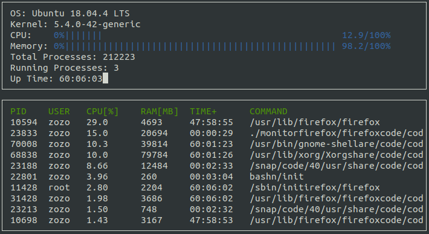

# CppND-System-Monitor

This project aims at building a Linux system monitor inspired by [htop](https://github.com/hishamhm/htop). It is meant to be hands-on training for the Object Oriented Programming Course of the [Udacity C++ Nanodegree Program](https://www.udacity.com/course/c-plus-plus-nanodegree--nd213). 



## Installation

- #### Prerequisite
The [ncurses](https://www.gnu.org/software/ncurses/) library is required to  facilitate text-based graphical output in the terminal to display the output of the monitor.

Install ncurses on your own Linux environment:

`sudo apt install libncurses5-dev libncursesw5-dev`

- #### Clone 
    ```
    git clone https://github.com/Robotawi/CppND-Linux-system-monitor.git
    ```

- #### Setup
    ```
    cd CppND-System-Monitor
    mkdir build 
    cd build
    cmake ..
    make
    ```
- #### Run
    From inside the build folder
    ```
    ./monitor
    ```
## Project description
The main functionality of the project depends on parsing the linux file system files to collect data about the operating system, the processor, and the running processes.

The information about the different system components are collected as follows:
- Operating system: `/etc/os-release`
- Kernel: `/proc/version`
- Memory utilization: `/proc/meminfo`
- Total processes: `/proc/meminfo`
- System up time: `/proc/uptime`
- Processor data: `/proc/stat`
- Username `/etc/passwd`
- Process up time `/proc/[pid]/stat`
- Process command `/proc/[pid]/cmdline`
- Process memory info `/proc/[pid]/status`
- Process CPU info `/proc/[PID]/stat`
  
## Useful resources for the implementation
- How to calculate the [memory utilization](/proc/uptime)?
- How to calculate [CPU utilization](https://stackoverflow.com/questions/23367857/accurate-calculation-of-cpu-usage-given-in-percentage-in-linux)?
- [man page](http://man7.org/linux/man-pages/man5/proc.5.html) for `proc`.
- Process identifier ([PID](https://en.wikipedia.org/wiki/Process_identifier)) number.
- User identifier ([UID](https://en.wikipedia.org/wiki/User_identifier)).
- How to calculate [process CPU utilization](https://stackoverflow.com/questions/16726779/how-do-i-get-the-total-cpu-usage-of-an-application-from-proc-pid-stat/16736599#16736599)?
  

## Contact
If you are interested in the presented work/ideas or if you have any questions, you are welcome to connect with me on [LinkedIn](https://www.linkedin.com/in/mohraess). We can discuss about this project and other interesting projects.